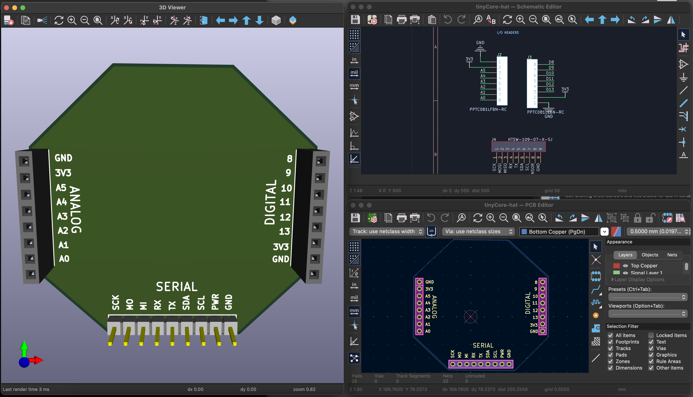

# TinyCore Hat Template

A starter template for creating custom hardware hats for the [TinyCore](https://mr.industries/) using CopperPilot.

## What's Included



This template provides:
- **Pin Headers**: Pre-configured connectors matching TinyCore's pinout
- **Board Outline**: Correctly sized PCB outline for a TinyCore hat
- **KiCad Project**: Ready-to-open schematic and PCB files

## Getting Started

### 1. Clone This Template

Clone the repo:

```bash
git clone https://github.com/CopperPilot/tinyCore-hat.git my-tinycore-hat
cd my-tinycore-hat
```

### 2. Open with CopperPilot

1. Launch CopperPilot
2. Open the project you just cloned
3. CopperPilot will automatically detect the KiCad project files

### 3. Start Designing with AI

CopperPilot uses AI to help you design hardware through natural conversation. Here's how:

**Chat with your schematic**: Describe what you want to build, and CopperPilot will:
- Search KiCad libraries for appropriate components
- Suggest multiple design options
- Add components to your schematic
- Wire up connections based on datasheets
- Place support components (resistors, capacitors, etc.)

**Example workflow** (based on our [walkie-talkie tutorial](https://copperpilot.ai/documentation/tutorial/walkie-talkie-hat)):

```
You: "I want to build a walkie-talkie hat using ESP-NOW protocol with a microphone and speaker"

CopperPilot: [Searches KiCad libraries and proposes options]

You: "Use option 2 with the analog mic and amplifier"

CopperPilot: [Adds components to schematic]

You: "Wire up the microphone"

CopperPilot: [Consults datasheets and creates connections]

You: "Now wire up the speaker"

CopperPilot: [Completes the speaker circuit with support components]
```

### 4. Review and Route

After CopperPilot adds components:
1. Review the proposed changes in the preview
2. Click "Accept changes" to apply them
3. Update the PCB from the schematic
4. Use a combination of auto-routing and manual routing for traces
5. Position support components as needed

### 5. Design Validation

Ask CopperPilot to review your design:

```
You: "Review my PCB design"
```

CopperPilot will identify issues like:
- Unconnected signal paths
- Missing components
- Routing problems
- Design rule violations

## Tips for Success

- **Be specific**: The more detail you provide, the better CopperPilot can help
- **Iterate**: Start simple, then add complexity
- **Review carefully**: Always check CopperPilot's suggestions before accepting
- **Use validation**: Regular design reviews catch issues early

## Example Projects

- **Walkie-Talkie Hat**: ESP-NOW communication with mic and speaker ([tutorial](https://copperpilot.ai/documentation/tutorial/walkie-talkie-hat))
- *Add your project here with a PR!*

## Need Help?

- 📚 [CopperPilot Documentation](https://copperpilot.ai/documentation)
- 💬 [Discord Community](https://discord.gg/yecEmkaGs8)

## Contributing

Found a bug or want to improve the template? Pull requests are welcome!

## License

MIT

---

**Ready to build?** Clone this template and start chatting with CopperPilot to bring your hardware ideas to life!
